# Busqueda machine on [hackthebox](https://app.hackthebox.com/)

Written by: Mustafa Musallati.

### Enumeration:


nmap scan:
```
Starting Nmap 7.94 ( https://nmap.org ) at 2023-10-11 03:38 EDT
Nmap scan report for 10.10.11.208
Host is up (0.081s latency).
Not shown: 998 closed tcp ports (reset)
PORT   STATE SERVICE VERSION
22/tcp open  ssh     OpenSSH 8.9p1 Ubuntu 3ubuntu0.1 (Ubuntu Linux; protocol 2.0)
80/tcp open  http    Apache httpd 2.4.52
Service Info: Host: searcher.htb; OS: Linux; CPE: cpe:/o:linux:linux_kernel

```

We will add the hostname "searcher.htb" to /etc/hosts:

`echo "10.10.11.208    searcher.htb" | sudo tee -a /etc/hosts`


The website:

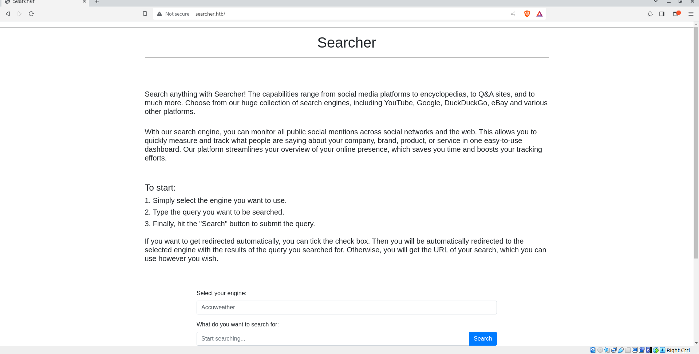

The website uses an open source package called "searchor", with 2.4.0 version, after searching and reading about it we can find a vulnerability in it, that allows us to execute code, so we can get a shell.


### Exploitation:

The exploit on GitHub:[Link.](https://github.com/nikn0laty/Exploit-for-Searchor-2.4.0-Arbitrary-CMD-Injection)

Highly recommended to check it.

After we run the code like this:
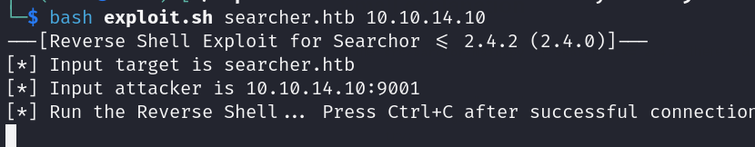


Let's check our listener:

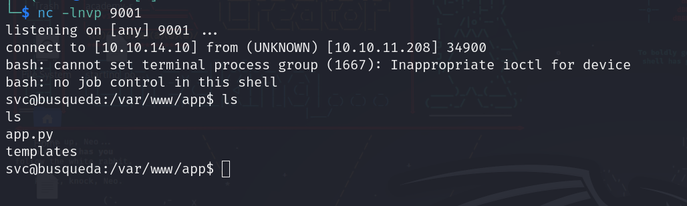

We got a shell!!

And easy user:

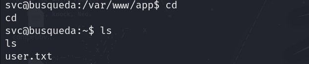

Now since we have a user let's generate ssh keys to access the system with a better shell.

On our local system:
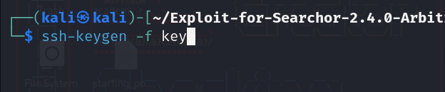

We are going to generate public and private key.
note: key is the name of the file outputed.

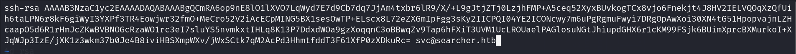

NOTE: it's important to change the "user@host" at the end of public key file.

after that we will copy our public key and put it in the target user directory at .ssh/authorized_keys file.

On our target machine:
```
echo "the public key text" >> .ssh/authorized_kyes
```


Then we will do this on our machine:

```
ssh -i key svc@10.10.11.208
```

And now we have a ssh session, time for enumeration for root.

In the directory that has the website, we see that its a git repo, so let's check the config file:

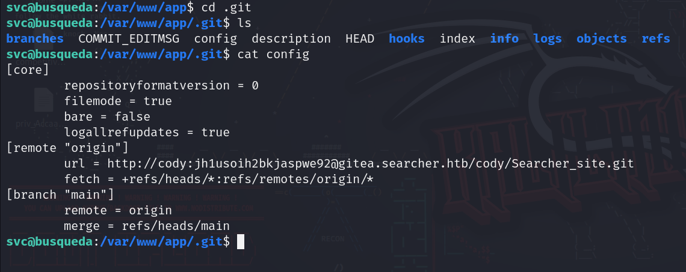
We see that there is a password, and there is a gitea subdomain running, let's first check if the password is for svc using sudo -l:

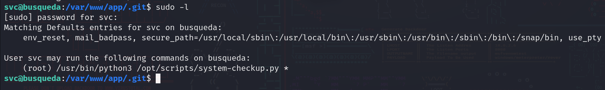
And it is....

Now let's add the gitea instance to /etc/hosts and check it:

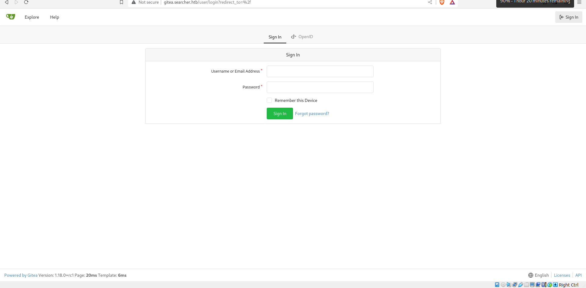
We have a gitea instance running (which if you dont know its a service used for private hosting of repositories).

Let's try to login with the credentials we found earlier:
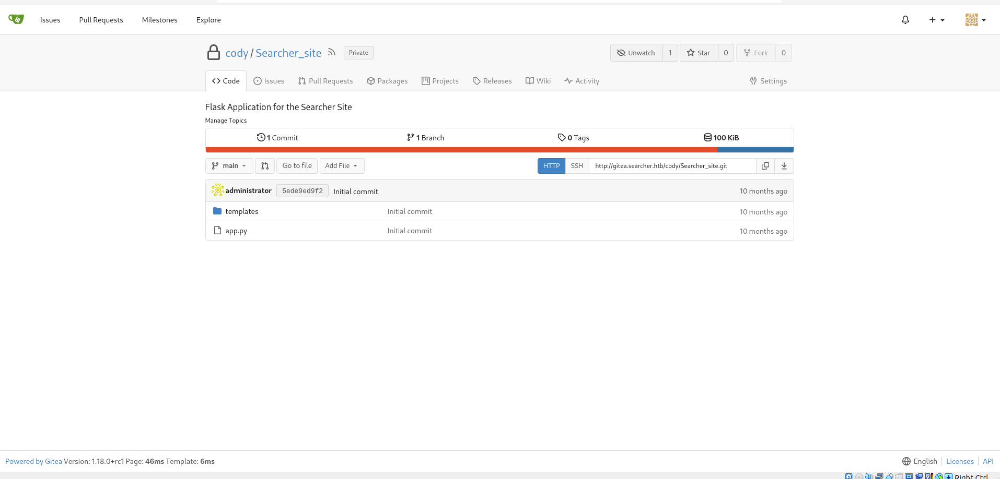

We can see that we have a repository with the web app, and there is a user called administrator, but upon trying to login to it with the same password, we fail...

So when we try to execute the script we were able to do with sudo, we can provide some arguments to it.

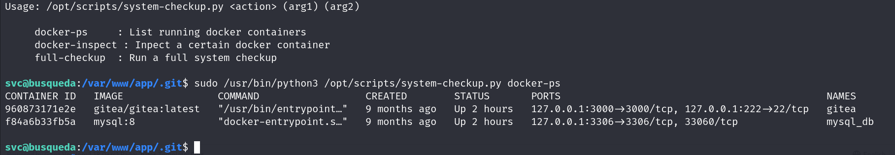

Also we can inspect certain containers, but when we do so we see that we need a format, googling about it really quick show us different formats and things we can see about a docker container.

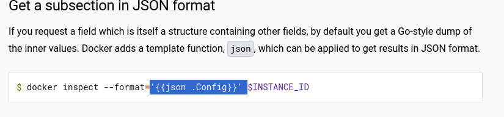

So we will do the following:

```
sudo /usr/bin/python3 /opt/scripts/system-checkup.py docker-inspect '{{json .Config}}' 9608
```

NOTE: 9608 is the ID of the gitea container.

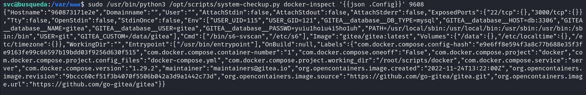

Let's echo this locally and check pipe it to "jq" to be easier to read:

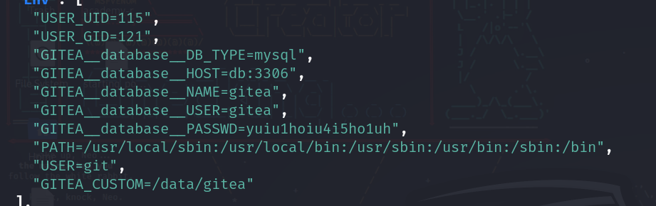

Here we can see we have another password, could this be for administrator?

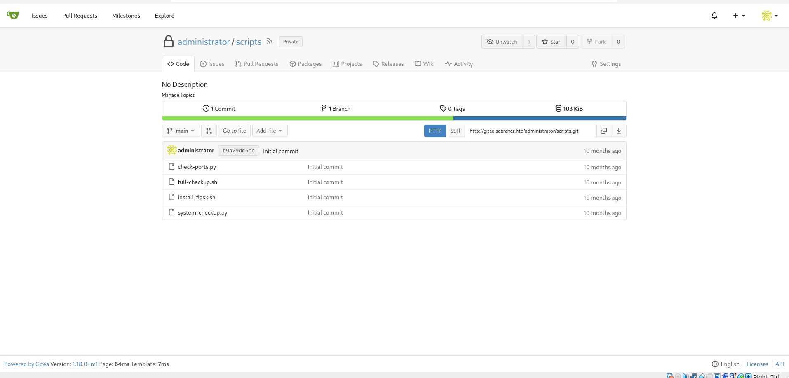

And it is!!

We have a couple of scripts code in here, so let's check them.


In one of the scripts, specifically "system checkup" we can see that when we execute it, it does call for a bash file in the current directory (where we execute the script) and it execute it, since we can run it with sudo, we can make a "custom" full-checkup.sh, and embed a reverse shell in it..

So we do the following:
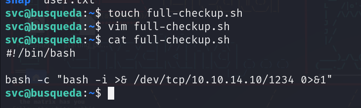

Making a script file and putting a reverse shell in it, then now let's execute the full-chekup as sudo:

```
sudo /usr/bin/python3 /opt/scripts/system-checkup.py full-checkup
```

Now checking our listener we can see we have root:

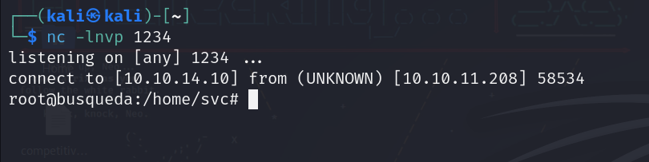


And done machine....

thanks for reading!

Good hunting!! :)


---

Written by: Mustafa Musallati.
[LinkedIn](https://www.linkedin.com/in/mustafa-musallati-95a159260/)
[instagram](https://www.instagram.com/accaard/)


